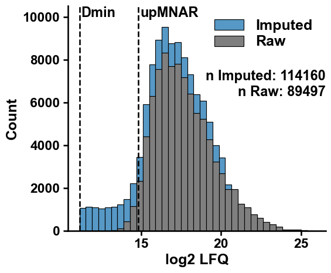

Conditional Imputation
======================

This is a tutorial on conditional imputation of missing values using
``cImpute``.

First import some third-party packages and ``xomics``:

.. code:: ipython3

    import pandas as pd
    import matplotlib.pyplot as plt
    from IPython.display import display, HTML
    
    import xomics as xo

.. code:: ipython3

    # Settings
    xo.plot_settings()
    groups = ["A", "B", "C", "D", "E", "F"]
    str_lfq = "log2 LFQ "
    str_ids = "Protein IDs"
    
    # Creat imputation object
    pp = xo.PreProcess(str_id=str_ids, str_lfq=str_lfq)
    cimp = xo.cImpute(str_id=str_ids, str_lfq=str_lfq)

.. code:: ipython3

    # Load data
    file = "data/raw_data_proteomics_lfq.xlsx"
    df_raw = pd.read_excel(file)
    dict_group_cols = pp.get_dict_groups(df=df_raw, groups=groups)
    all_groups_col = pp.get_all_group_cols(dict_group_cols=dict_group_cols)

.. code:: ipython3

    # Imputation
    loc_up_mnar = 0.2
    d_min, up_mnar, d_max = cimp.get_limits(df=df_raw.copy(),
                                            group_cols=all_groups_col,
                                            loc_up_mnar=loc_up_mnar)
    df_imput = cimp.run(df=df_raw.copy(),
                        dict_group_cols=dict_group_cols,
                        min_cs=0.5,
                        loc_up_mnar=loc_up_mnar,
                        std_factor=0.8,
                        n_neigbhors=6)
    display(df_raw)
    display(df_imput)

.. raw:: html

    

    
    <table border="1" class="dataframe">
      <thead>
        <tr style="text-align: right;">
          <th></th>
          <th>Protein IDs</th>
          <th>log2 LFQ A_1</th>
          <th>log2 LFQ A_2</th>
          <th>log2 LFQ A_3</th>
          <th>log2 LFQ A_4</th>
          <th>log2 LFQ A_5</th>
          <th>log2 LFQ A_6</th>
          <th>log2 LFQ A_7</th>
          <th>log2 LFQ A_8</th>
          <th>log2 LFQ B_1</th>
          <th>...</th>
          <th>log2 LFQ E_6</th>
          <th>log2 LFQ E_7</th>
          <th>log2 LFQ E_8</th>
          <th>log2 LFQ F_1</th>
          <th>log2 LFQ F_2</th>
          <th>log2 LFQ F_3</th>
          <th>log2 LFQ F_4</th>
          <th>log2 LFQ F_5</th>
          <th>log2 LFQ F_6</th>
          <th>log2 LFQ F_7</th>
        </tr>
      </thead>
      <tbody>
        <tr>
          <th>0</th>
          <td>Protein0001</td>
          <td>NaN</td>
          <td>27.272221</td>
          <td>25.922796</td>
          <td>25.922432</td>
          <td>25.277178</td>
          <td>NaN</td>
          <td>NaN</td>
          <td>24.927731</td>
          <td>NaN</td>
          <td>...</td>
          <td>23.768906</td>
          <td>20.753361</td>
          <td>25.682444</td>
          <td>18.955008</td>
          <td>14.841122</td>
          <td>NaN</td>
          <td>26.132320</td>
          <td>18.388605</td>
          <td>18.504051</td>
          <td>NaN</td>
        </tr>
        <tr>
          <th>1</th>
          <td>Protein0002</td>
          <td>NaN</td>
          <td>22.973932</td>
          <td>22.040863</td>
          <td>22.421959</td>
          <td>21.887550</td>
          <td>NaN</td>
          <td>NaN</td>
          <td>NaN</td>
          <td>19.368668</td>
          <td>...</td>
          <td>NaN</td>
          <td>NaN</td>
          <td>22.289402</td>
          <td>NaN</td>
          <td>NaN</td>
          <td>18.723541</td>
          <td>22.490717</td>
          <td>NaN</td>
          <td>19.065342</td>
          <td>NaN</td>
        </tr>
        <tr>
          <th>2</th>
          <td>Protein0003</td>
          <td>NaN</td>
          <td>26.362188</td>
          <td>26.277479</td>
          <td>25.700308</td>
          <td>26.063425</td>
          <td>NaN</td>
          <td>NaN</td>
          <td>23.785065</td>
          <td>NaN</td>
          <td>...</td>
          <td>22.482370</td>
          <td>NaN</td>
          <td>24.954735</td>
          <td>NaN</td>
          <td>17.709272</td>
          <td>NaN</td>
          <td>25.368429</td>
          <td>NaN</td>
          <td>NaN</td>
          <td>NaN</td>
        </tr>
        <tr>
          <th>3</th>
          <td>Protein0004</td>
          <td>NaN</td>
          <td>24.622601</td>
          <td>24.937551</td>
          <td>24.028673</td>
          <td>24.003332</td>
          <td>NaN</td>
          <td>NaN</td>
          <td>22.179192</td>
          <td>NaN</td>
          <td>...</td>
          <td>NaN</td>
          <td>18.779694</td>
          <td>23.625000</td>
          <td>NaN</td>
          <td>NaN</td>
          <td>NaN</td>
          <td>23.904903</td>
          <td>NaN</td>
          <td>NaN</td>
          <td>NaN</td>
        </tr>
        <tr>
          <th>4</th>
          <td>Protein0005</td>
          <td>NaN</td>
          <td>26.373484</td>
          <td>25.566917</td>
          <td>24.636662</td>
          <td>24.215416</td>
          <td>NaN</td>
          <td>NaN</td>
          <td>24.307581</td>
          <td>NaN</td>
          <td>...</td>
          <td>23.111446</td>
          <td>18.772238</td>
          <td>24.299429</td>
          <td>20.258911</td>
          <td>NaN</td>
          <td>NaN</td>
          <td>24.806562</td>
          <td>NaN</td>
          <td>NaN</td>
          <td>NaN</td>
        </tr>
        <tr>
          <th>...</th>
          <td>...</td>
          <td>...</td>
          <td>...</td>
          <td>...</td>
          <td>...</td>
          <td>...</td>
          <td>...</td>
          <td>...</td>
          <td>...</td>
          <td>...</td>
          <td>...</td>
          <td>...</td>
          <td>...</td>
          <td>...</td>
          <td>...</td>
          <td>...</td>
          <td>...</td>
          <td>...</td>
          <td>...</td>
          <td>...</td>
          <td>...</td>
        </tr>
        <tr>
          <th>1984</th>
          <td>Protein1985</td>
          <td>NaN</td>
          <td>21.802860</td>
          <td>20.268993</td>
          <td>NaN</td>
          <td>20.865973</td>
          <td>NaN</td>
          <td>NaN</td>
          <td>18.424601</td>
          <td>NaN</td>
          <td>...</td>
          <td>NaN</td>
          <td>NaN</td>
          <td>NaN</td>
          <td>NaN</td>
          <td>19.074492</td>
          <td>18.202038</td>
          <td>NaN</td>
          <td>NaN</td>
          <td>NaN</td>
          <td>NaN</td>
        </tr>
        <tr>
          <th>1985</th>
          <td>Protein1986</td>
          <td>NaN</td>
          <td>21.085827</td>
          <td>20.012226</td>
          <td>21.334127</td>
          <td>NaN</td>
          <td>NaN</td>
          <td>NaN</td>
          <td>NaN</td>
          <td>NaN</td>
          <td>...</td>
          <td>NaN</td>
          <td>NaN</td>
          <td>NaN</td>
          <td>NaN</td>
          <td>NaN</td>
          <td>NaN</td>
          <td>NaN</td>
          <td>NaN</td>
          <td>NaN</td>
          <td>NaN</td>
        </tr>
        <tr>
          <th>1986</th>
          <td>Protein1987</td>
          <td>NaN</td>
          <td>21.494091</td>
          <td>20.655870</td>
          <td>21.144823</td>
          <td>NaN</td>
          <td>NaN</td>
          <td>NaN</td>
          <td>NaN</td>
          <td>NaN</td>
          <td>...</td>
          <td>NaN</td>
          <td>NaN</td>
          <td>NaN</td>
          <td>NaN</td>
          <td>NaN</td>
          <td>NaN</td>
          <td>NaN</td>
          <td>NaN</td>
          <td>NaN</td>
          <td>NaN</td>
        </tr>
        <tr>
          <th>1987</th>
          <td>Protein1988</td>
          <td>NaN</td>
          <td>22.458338</td>
          <td>22.068317</td>
          <td>21.164228</td>
          <td>NaN</td>
          <td>NaN</td>
          <td>NaN</td>
          <td>NaN</td>
          <td>NaN</td>
          <td>...</td>
          <td>NaN</td>
          <td>NaN</td>
          <td>21.489689</td>
          <td>NaN</td>
          <td>NaN</td>
          <td>NaN</td>
          <td>21.709650</td>
          <td>NaN</td>
          <td>NaN</td>
          <td>NaN</td>
        </tr>
        <tr>
          <th>1988</th>
          <td>Protein1989</td>
          <td>NaN</td>
          <td>25.168253</td>
          <td>23.133955</td>
          <td>21.571959</td>
          <td>22.226410</td>
          <td>NaN</td>
          <td>NaN</td>
          <td>NaN</td>
          <td>NaN</td>
          <td>...</td>
          <td>NaN</td>
          <td>NaN</td>
          <td>NaN</td>
          <td>NaN</td>
          <td>NaN</td>
          <td>19.746981</td>
          <td>21.988396</td>
          <td>NaN</td>
          <td>NaN</td>
          <td>NaN</td>
        </tr>
      </tbody>
    </table>
    
1989 rows × 48 columns

    

.. raw:: html

    

    
    <table border="1" class="dataframe">
      <thead>
        <tr style="text-align: right;">
          <th></th>
          <th>log2 LFQ A_1</th>
          <th>log2 LFQ A_2</th>
          <th>log2 LFQ A_3</th>
          <th>log2 LFQ A_4</th>
          <th>log2 LFQ A_5</th>
          <th>log2 LFQ A_6</th>
          <th>log2 LFQ A_7</th>
          <th>log2 LFQ A_8</th>
          <th>log2 LFQ B_1</th>
          <th>log2 LFQ B_2</th>
          <th>...</th>
          <th>CS_C</th>
          <th>CS_D</th>
          <th>CS_E</th>
          <th>CS_F</th>
          <th>NaN_A</th>
          <th>NaN_B</th>
          <th>NaN_C</th>
          <th>NaN_D</th>
          <th>NaN_E</th>
          <th>NaN_F</th>
        </tr>
        <tr>
          <th>Protein IDs</th>
          <th></th>
          <th></th>
          <th></th>
          <th></th>
          <th></th>
          <th></th>
          <th></th>
          <th></th>
          <th></th>
          <th></th>
          <th></th>
          <th></th>
          <th></th>
          <th></th>
          <th></th>
          <th></th>
          <th></th>
          <th></th>
          <th></th>
          <th></th>
          <th></th>
        </tr>
      </thead>
      <tbody>
        <tr>
          <th>Protein0001</th>
          <td>20.769350</td>
          <td>27.272221</td>
          <td>25.922796</td>
          <td>25.922432</td>
          <td>25.277178</td>
          <td>21.212935</td>
          <td>21.780364</td>
          <td>24.927731</td>
          <td>19.879334</td>
          <td>20.325863</td>
          <td>...</td>
          <td>1.00</td>
          <td>1.00</td>
          <td>1.00</td>
          <td>0.00</td>
          <td>MCAR</td>
          <td>MCAR</td>
          <td>MCAR</td>
          <td>MCAR</td>
          <td>MCAR</td>
          <td>MAR</td>
        </tr>
        <tr>
          <th>Protein0002</th>
          <td>21.386591</td>
          <td>22.973932</td>
          <td>22.040863</td>
          <td>22.421959</td>
          <td>21.887550</td>
          <td>20.535161</td>
          <td>21.680469</td>
          <td>21.719430</td>
          <td>19.368668</td>
          <td>19.911213</td>
          <td>...</td>
          <td>1.00</td>
          <td>0.38</td>
          <td>0.62</td>
          <td>0.43</td>
          <td>MCAR</td>
          <td>MCAR</td>
          <td>MNAR</td>
          <td>MCAR</td>
          <td>MCAR</td>
          <td>MCAR</td>
        </tr>
        <tr>
          <th>Protein0003</th>
          <td>22.210057</td>
          <td>26.362188</td>
          <td>26.277479</td>
          <td>25.700308</td>
          <td>26.063425</td>
          <td>21.860414</td>
          <td>21.848587</td>
          <td>23.785065</td>
          <td>NaN</td>
          <td>NaN</td>
          <td>...</td>
          <td>1.00</td>
          <td>0.75</td>
          <td>0.88</td>
          <td>0.29</td>
          <td>MCAR</td>
          <td>MCAR</td>
          <td>MCAR</td>
          <td>MCAR</td>
          <td>MCAR</td>
          <td>MCAR</td>
        </tr>
        <tr>
          <th>Protein0004</th>
          <td>21.224265</td>
          <td>24.622601</td>
          <td>24.937551</td>
          <td>24.028673</td>
          <td>24.003332</td>
          <td>20.298384</td>
          <td>21.968019</td>
          <td>22.179192</td>
          <td>13.966153</td>
          <td>15.697899</td>
          <td>...</td>
          <td>0.00</td>
          <td>0.00</td>
          <td>0.75</td>
          <td>0.14</td>
          <td>MCAR</td>
          <td>MNAR</td>
          <td>MAR</td>
          <td>MAR</td>
          <td>MCAR</td>
          <td>MCAR</td>
        </tr>
        <tr>
          <th>Protein0005</th>
          <td>20.634347</td>
          <td>26.373484</td>
          <td>25.566917</td>
          <td>24.636662</td>
          <td>24.215416</td>
          <td>19.846755</td>
          <td>20.807572</td>
          <td>24.307581</td>
          <td>NaN</td>
          <td>NaN</td>
          <td>...</td>
          <td>0.00</td>
          <td>0.88</td>
          <td>1.00</td>
          <td>0.29</td>
          <td>MCAR</td>
          <td>MAR</td>
          <td>MAR</td>
          <td>MCAR</td>
          <td>MCAR</td>
          <td>MCAR</td>
        </tr>
        <tr>
          <th>...</th>
          <td>...</td>
          <td>...</td>
          <td>...</td>
          <td>...</td>
          <td>...</td>
          <td>...</td>
          <td>...</td>
          <td>...</td>
          <td>...</td>
          <td>...</td>
          <td>...</td>
          <td>...</td>
          <td>...</td>
          <td>...</td>
          <td>...</td>
          <td>...</td>
          <td>...</td>
          <td>...</td>
          <td>...</td>
          <td>...</td>
          <td>...</td>
        </tr>
        <tr>
          <th>Protein1985</th>
          <td>20.723994</td>
          <td>21.802860</td>
          <td>20.268993</td>
          <td>21.103184</td>
          <td>20.865973</td>
          <td>20.572797</td>
          <td>20.456413</td>
          <td>18.424601</td>
          <td>12.358371</td>
          <td>14.935295</td>
          <td>...</td>
          <td>1.00</td>
          <td>1.00</td>
          <td>0.25</td>
          <td>0.29</td>
          <td>MCAR</td>
          <td>MNAR</td>
          <td>MNAR</td>
          <td>MNAR</td>
          <td>MCAR</td>
          <td>MCAR</td>
        </tr>
        <tr>
          <th>Protein1986</th>
          <td>NaN</td>
          <td>21.085827</td>
          <td>20.012226</td>
          <td>21.334127</td>
          <td>NaN</td>
          <td>NaN</td>
          <td>NaN</td>
          <td>NaN</td>
          <td>12.177962</td>
          <td>15.398258</td>
          <td>...</td>
          <td>1.00</td>
          <td>1.00</td>
          <td>1.00</td>
          <td>1.00</td>
          <td>MCAR</td>
          <td>MNAR</td>
          <td>MNAR</td>
          <td>MNAR</td>
          <td>MNAR</td>
          <td>MNAR</td>
        </tr>
        <tr>
          <th>Protein1987</th>
          <td>NaN</td>
          <td>21.494091</td>
          <td>20.655870</td>
          <td>21.144823</td>
          <td>NaN</td>
          <td>NaN</td>
          <td>NaN</td>
          <td>NaN</td>
          <td>13.275301</td>
          <td>13.506343</td>
          <td>...</td>
          <td>1.00</td>
          <td>1.00</td>
          <td>1.00</td>
          <td>1.00</td>
          <td>MCAR</td>
          <td>MNAR</td>
          <td>MNAR</td>
          <td>MNAR</td>
          <td>MNAR</td>
          <td>MNAR</td>
        </tr>
        <tr>
          <th>Protein1988</th>
          <td>NaN</td>
          <td>22.458338</td>
          <td>22.068317</td>
          <td>21.164228</td>
          <td>NaN</td>
          <td>NaN</td>
          <td>NaN</td>
          <td>NaN</td>
          <td>15.147106</td>
          <td>13.077360</td>
          <td>...</td>
          <td>1.00</td>
          <td>1.00</td>
          <td>0.38</td>
          <td>0.14</td>
          <td>MCAR</td>
          <td>MNAR</td>
          <td>MNAR</td>
          <td>MNAR</td>
          <td>MCAR</td>
          <td>MCAR</td>
        </tr>
        <tr>
          <th>Protein1989</th>
          <td>22.084077</td>
          <td>25.168253</td>
          <td>23.133955</td>
          <td>21.571959</td>
          <td>22.226410</td>
          <td>19.582955</td>
          <td>19.703981</td>
          <td>21.802678</td>
          <td>NaN</td>
          <td>NaN</td>
          <td>...</td>
          <td>0.38</td>
          <td>0.12</td>
          <td>0.25</td>
          <td>0.29</td>
          <td>MCAR</td>
          <td>MCAR</td>
          <td>MCAR</td>
          <td>MCAR</td>
          <td>MCAR</td>
          <td>MCAR</td>
        </tr>
      </tbody>
    </table>
    
1989 rows × 61 columns

    

.. code:: ipython3

    # Plot histogram
    xo.plot_imput_histo(df_raw=df_raw,
                        df_imput=df_imput,
                        cols=all_groups_col,
                        d_min=d_min,
                        up_mnar=up_mnar)
    plt.show()
    plt.close()

.. code:: ipython3

    # Plot scatter plot for each group
    df_raw_plot = df_raw.set_index(str_ids)
    df_raw_plot = df_raw_plot.sort_index()
    for group in dict_group_cols:
        cols = dict_group_cols[group]
        xo.plot_imput_scatter(df_raw=df_raw_plot, df_imput=df_imput, cols=cols, group=group)
        plt.show()
        plt.close()
        break

.. parsed-literal::

    <Figure size 600x700 with 0 Axes>

.. image:: NOTEBOOK_2_output_6_1.png

