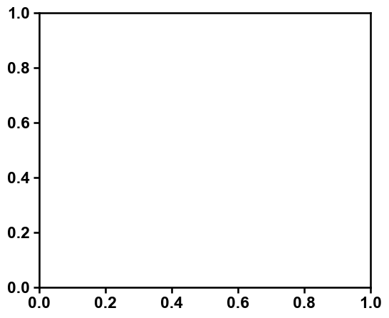

Conditional Imputation
======================

This is a tutorial on conditional imputation of missing values using
``cImpute``.

First import some third-party packages and ``xomics``:

.. code:: ipython3

    import pandas as pd
    import matplotlib.pyplot as plt
    
    import xomics as xo

.. code:: ipython3

    # Settings
    xo.plot_settings()
    groups = ["d00", "d03", "d07", "d14"]
    
    # Creat imputation object

.. code:: ipython3

    # Load data
    df_raw = xo.load_dataset() 

.. code:: ipython3

    # Imputation
    df_imp = xo.cImpute().run(df=df_raw, groups=groups, min_cs=0.5)
    d_min, up_mnar, d_max = xo.cImpute().get_limits(df=df_raw, groups=groups)

.. code:: ipython3

    # Plot histogram
    pp = xo.PreProcess()
    cols_quant = pp.get_qcols(df=df_imp, groups=groups)
    xo.plot_settings()
    xo.plot_imput_histo(df_raw=df_raw,
                        df_imp=df_imp,
                        d_min=d_min,
                        up_mnar=up_mnar,
                        cols_quant=cols_quant)
    plt.show()

::

    ---------------------------------------------------------------------------

    OptionError                               Traceback (most recent call last)

    /tmp/ipykernel_12917/171716158.py in <module>
          3 cols_quant = pp.get_qcols(df=df_imp, groups=groups)
          4 xo.plot_settings()
    ----> 5 xo.plot_imput_histo(df_raw=df_raw,
          6                     df_imp=df_imp,
          7                     d_min=d_min,

    ~/Programming/Pycharm_Projekte/1Packages/xomics/xomics/plotting/_plot_imput_histo.py in plot_imput_histo(ax, figsize, df_raw, df_imp, cols_quant, d_min, up_mnar, alpha, binwidth, colors, y_max, x_max, **kwargs)
         82     if ax is None:
         83         fig, ax = plt.subplots(figsize=figsize)
    ---> 84 
         85     sns.histplot(ax=ax, data=vals_imp, color=colors[1], alpha=alpha, **_args)
         86     sns.histplot(ax=ax, data=vals_raw, color=colors[0], alpha=1, **_args)

    /usr/local/lib/python3.8/site-packages/seaborn/distributions.py in histplot(data, x, y, hue, weights, stat, bins, binwidth, binrange, discrete, cumulative, common_bins, common_norm, multiple, element, fill, shrink, kde, kde_kws, line_kws, thresh, pthresh, pmax, cbar, cbar_ax, cbar_kws, palette, hue_order, hue_norm, color, log_scale, legend, ax, **kwargs)
       1460     if p.univariate:
       1461 
    -> 1462         p.plot_univariate_histogram(
       1463             multiple=multiple,
       1464             element=element,

    /usr/local/lib/python3.8/site-packages/seaborn/distributions.py in plot_univariate_histogram(self, multiple, element, fill, common_norm, common_bins, shrink, kde, kde_kws, color, legend, line_kws, estimate_kws, **plot_kws)
        426 
        427         # First pass through the data to compute the histograms
    --> 428         for sub_vars, sub_data in self.iter_data("hue", from_comp_data=True):
        429 
        430             # Prepare the relevant data

    /usr/local/lib/python3.8/site-packages/seaborn/_core.py in iter_data(self, grouping_vars, reverse, from_comp_data)
        981 
        982         if from_comp_data:
    --> 983             data = self.comp_data
        984         else:
        985             data = self.plot_data

    /usr/local/lib/python3.8/site-packages/seaborn/_core.py in comp_data(self)
       1052                 # Use the converter assigned to the axis to get a float representation
       1053                 # of the data, passing np.nan or pd.NA through (pd.NA becomes np.nan)
    -> 1054                 with pd.option_context('mode.use_inf_as_null', True):
       1055                     orig = self.plot_data[var].dropna()
       1056                 comp_col = pd.Series(index=orig.index, dtype=float, name=var)

    ~/.local/lib/python3.8/site-packages/pandas/_config/config.py in __enter__(self)
        439 
        440     def __enter__(self) -> None:
    --> 441         self.undo = [(pat, _get_option(pat, silent=True)) for pat, val in self.ops]
        442 
        443         for pat, val in self.ops:

    ~/.local/lib/python3.8/site-packages/pandas/_config/config.py in <listcomp>(.0)
        439 
        440     def __enter__(self) -> None:
    --> 441         self.undo = [(pat, _get_option(pat, silent=True)) for pat, val in self.ops]
        442 
        443         for pat, val in self.ops:

    ~/.local/lib/python3.8/site-packages/pandas/_config/config.py in _get_option(pat, silent)
        133 
        134 def _get_option(pat: str, silent: bool = False) -> Any:
    --> 135     key = _get_single_key(pat, silent)
        136 
        137     # walk the nested dict

    ~/.local/lib/python3.8/site-packages/pandas/_config/config.py in _get_single_key(pat, silent)
        119         if not silent:
        120             _warn_if_deprecated(pat)
    --> 121         raise OptionError(f"No such keys(s): {repr(pat)}")
        122     if len(keys) > 1:
        123         raise OptionError("Pattern matched multiple keys")

    OptionError: "No such keys(s): 'mode.use_inf_as_null'"

