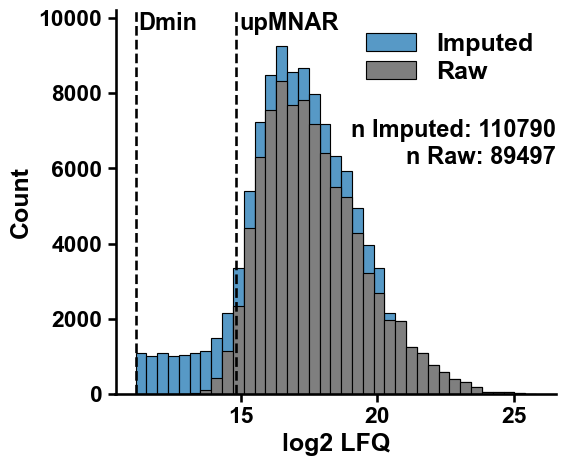

Conditional Imputation
======================

This is a tutorial on conditional imputation of missing values using
``cImpute``.

First import some third-party packages and ``xomics``:

.. code:: ipython3

    import matplotlib.pyplot as plt
    import xomics as xo

.. code:: ipython3

    # Settings
    groups = ["d00", "d03", "d07", "d14"]
    pp = xo.PreProcess()

.. code:: ipython3

    # Load data
    df_raw = xo.load_dataset() 
    cols_quant = pp.get_qcols(df=df_raw, groups=groups)

.. code:: ipython3

    # Imputation
    df_imp = xo.cImpute().run(df=df_raw, groups=groups, min_cs=0.5)
    d_min, up_mnar, d_max = xo.cImpute().get_limits(df=df_raw, groups=groups)

.. code:: ipython3

    # Plot histogram
    xo.plot_settings()
    xo.plot_imput_histo(df_raw=df_raw,
                        df_imp=df_imp,
                        d_min=d_min,
                        up_mnar=up_mnar,
                        cols_quant=cols_quant)
    plt.show()

.. image:: NOTEBOOK_1_output_5_0.png

.. code:: ipython3

    df_imp = xo.cImpute().run(df=df_raw, groups=groups, min_cs=1)
    d_min, up_mnar, d_max = xo.cImpute().get_limits(df=df_raw, groups=groups)
    xo.plot_settings()
    xo.plot_imput_histo(df_raw=df_raw,
                        df_imp=df_imp,
                        d_min=d_min,
                        up_mnar=up_mnar,
                        cols_quant=cols_quant)
    plt.show()

