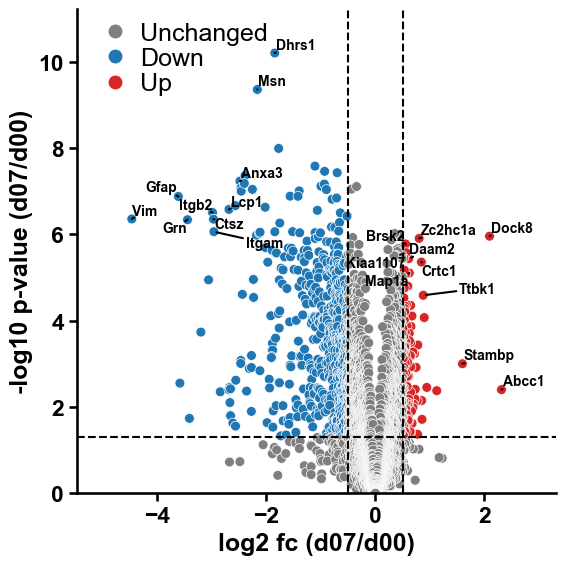

Multi-omics data integration
============================

We will perform a short integration of a proteomics and lipidomics
dataset obtained for a demylination (i.e., damage to the myelin sheath
surrounding neurons) experiment with four time points given by days (0,
4, 7, and 14, abbreviated by ‘d00’, ‘d04’, ‘d07’, and ‘d14’). See
details of this study in [Penkert21].

We can download both datasets which are provided by xOmics as use-case
datasets as follows:

.. code:: ipython2

    import xomics as xo
    df_prot = xo.load_dataset(name="PROT_DEMYLINATION")
    df_lip = xo.load_dataset(name="LIPID_DEMYLINATION")

Focusing on a comparison of day 7 against day 0, we can first define all
constants for our analysis:

.. code:: ipython2

    groups = ["d00", "d03", "d07", "d14"]
    args_col = dict(col_fc="log2_fc_(d07/d00)", col_pval="-log10_p-value_(d07/d00)")
    # Lipidomics data were measured in pikomol using an external standard
    args_lip = dict(col_id="lipid_id", col_name="lipid_name", str_quant="pmol")
    # Proteomics data were measured using label free quantification (LFQ)
    args_prot = dict(col_id="protein_id", col_name="gene_name", str_quant="log2_lfq")

We first perform some filtering steps and compute the fold changes for
our proteomics data:

.. code:: ipython2

    # Pre-processing
    pp = xo.PreProcess(**args_prot)
    pr = xo.pRank(**args_prot)
    df_lfq = pp.filter_groups(df=df_prot, groups=groups)
    df_lfq = pp.filter_duplicated_names(df=df_lfq, col="gene_name")
    # Compute fold change (FC) and p-values
    df_fc = pp.run(df=df_lfq, groups=groups, groups_ctrl=["d00"])
    df_fc = pp.filter_nan(df=df_fc, cols=["log2_fc_(d07/d00)", "-log10_p-value_(d07/d00)"])

Now the threshold based significance and P-scores can be computed:

.. code:: ipython2

    df_fc = pp.add_significance(df=df_fc, **args_col)
    df_fc = pr.p_score(df_fc=df_fc, **args_col)
    df_fc.head(5)

.. raw:: html

    

    
    <table border="1" class="dataframe">
      <thead>
        <tr style="text-align: right;">
          <th></th>
          <th>protein_id</th>
          <th>gene_name</th>
          <th>log2_fc_(d03/d00)</th>
          <th>log2_fc_(d07/d00)</th>
          <th>log2_fc_(d14/d00)</th>
          <th>-log10_p-value_(d03/d00)</th>
          <th>-log10_p-value_(d07/d00)</th>
          <th>-log10_p-value_(d14/d00)</th>
          <th>sig_class</th>
          <th>p_score</th>
        </tr>
      </thead>
      <tbody>
        <tr>
          <th>0</th>
          <td>Q8K4G5</td>
          <td>Ablim1</td>
          <td>-0.528</td>
          <td>-0.6825</td>
          <td>-0.220</td>
          <td>4.230306</td>
          <td>5.312642</td>
          <td>3.140084</td>
          <td>Down</td>
          <td>0.340022</td>
        </tr>
        <tr>
          <th>1</th>
          <td>Q91ZJ5</td>
          <td>Ugp2</td>
          <td>-0.036</td>
          <td>-0.2850</td>
          <td>-0.518</td>
          <td>0.248030</td>
          <td>4.640008</td>
          <td>6.791086</td>
          <td>Unchanged</td>
          <td>0.246418</td>
        </tr>
        <tr>
          <th>2</th>
          <td>P53986</td>
          <td>Slc16a1</td>
          <td>-0.084</td>
          <td>-0.4410</td>
          <td>-0.806</td>
          <td>0.317540</td>
          <td>3.634130</td>
          <td>6.823463</td>
          <td>Unchanged</td>
          <td>0.228351</td>
        </tr>
        <tr>
          <th>3</th>
          <td>P24270</td>
          <td>Cat</td>
          <td>-0.186</td>
          <td>-0.7560</td>
          <td>-0.384</td>
          <td>1.586811</td>
          <td>5.169079</td>
          <td>4.096977</td>
          <td>Down</td>
          <td>0.345767</td>
        </tr>
        <tr>
          <th>4</th>
          <td>Q99KC8</td>
          <td>Vwa5a</td>
          <td>-0.352</td>
          <td>-0.7130</td>
          <td>-1.056</td>
          <td>1.420013</td>
          <td>4.742200</td>
          <td>7.742758</td>
          <td>Down</td>
          <td>0.320359</td>
        </tr>
      </tbody>
    </table>
    

We use this to highlight the proteins with the strongest proteomic
signal in a volcano plot

.. code:: ipython2

    import matplotlib.pyplot as plt
    df_fc = df_fc.sort_values(by="p_score", ascending=False)
    top_genes_up = df_fc[df_fc["sig_class"] == "Up"]["gene_name"].to_list()[0:10]
    top_genes_down = df_fc[df_fc["sig_class"] == "Down"]["gene_name"].to_list()[0:10]
    top_genes = top_genes_down + top_genes_up
    xo.plot_settings()
    xo.plot_volcano(df=df_fc, **args_col, names_to_annotate=top_genes, col_names="gene_name")
    plt.tight_layout()
    plt.show()

We can now obtain the significantly altered proteins and perform a gene
set enrichment analysis using
``g:Profiler <https://biit.cs.ut.ee/gprofiler/gost>``\ \_ with default
settings and using all Gene Ontology and biological pathways data
sources. A list of ‘target_genes’ has to be provided, and it is highly
recommended to use a customized ‘background’ by setting in ‘Advanced
options’ the ‘Statistical domain scope’ to ‘Custom’ and copy-pasting
your entire list of detected proteins.

.. code:: ipython2

    background = df_fc["gene_name"].to_list()
    target_genes = df_fc[df_fc["sig_class"].isin(["Up", "Down"])]["gene_name"].to_list()
    print(f"Target list comprises {len(target_genes)} genes, which is a subset of the complete background list including {len(background)} genes.")

.. parsed-literal::

    Target list comprises 644 genes, which is a subset of the complete background list including 4526 genes.

Run g:Profiler und download the ‘Detailed Results’ as GEM and convert
the .txt file into a .tsv file. We provide the results of this
enrichment analysis as use-case by using ``xo.load_dataset`` and setting
``name='gProfiler_DEMYLINATION'``:

.. code:: ipython2

    df_gprof = xo.load_dataset(name="gProfiler_DEMYLINATION")
    df_gporf = pp.apply_log(df=df_gprof, cols=["p.val"], log2=False, neg=True)
    df_gprof.head(5)

.. raw:: html

    

    
    <table border="1" class="dataframe">
      <thead>
        <tr style="text-align: right;">
          <th></th>
          <th>go.id</th>
          <th>description</th>
          <th>p.val</th>
          <th>fdr</th>
          <th>phenotype</th>
          <th>genes</th>
        </tr>
      </thead>
      <tbody>
        <tr>
          <th>0</th>
          <td>GO:0003735</td>
          <td>structural constituent of ribosome</td>
          <td>2.875376e-09</td>
          <td>2.875376e-09</td>
          <td>1</td>
          <td>RPL18,RPL27,RPL5,RPL27A,RPS28,RPL29,RPS14,MRPL...</td>
        </tr>
        <tr>
          <th>1</th>
          <td>GO:0003779</td>
          <td>actin binding</td>
          <td>2.727871e-04</td>
          <td>2.727871e-04</td>
          <td>1</td>
          <td>DAAM2,ANLN,MRTFB,ADCY8,PHACTR1,MAP1A,ABLIM1,CO...</td>
        </tr>
        <tr>
          <th>2</th>
          <td>GO:0005198</td>
          <td>structural molecule activity</td>
          <td>4.333399e-02</td>
          <td>4.333399e-02</td>
          <td>1</td>
          <td>CRYAB,PLLP,MAP1A,RPL18,RPL27,H4C1,CD2AP,RPL5,R...</td>
        </tr>
        <tr>
          <th>3</th>
          <td>GO:0002181</td>
          <td>cytoplasmic translation</td>
          <td>9.007092e-05</td>
          <td>9.007092e-05</td>
          <td>1</td>
          <td>RPL18,RPL27,HNRNPU,RPL5,YBX1,RPL27A,RPS28,NMNA...</td>
        </tr>
        <tr>
          <th>4</th>
          <td>GO:0042274</td>
          <td>ribosomal small subunit biogenesis</td>
          <td>6.388875e-04</td>
          <td>6.388875e-04</td>
          <td>1</td>
          <td>RPS28,RPS14,RPS8,RPS13,RPS24,RPS3A,RPS5,RPS12,...</td>
        </tr>
      </tbody>
    </table>
    

These enrichment results can be used to obtain a protein-centric
enrichment-based ranking score called E-score:

.. code:: ipython2

    # TODO

To perform an enrichment analysis for the lipidomics data, we obtain as
well all significantly changed lipids and use this time
``LION/web server <http://www.lipidontology.com/>``. The results are
provided by xOmics by using ``xo.load_dataset`` with
``name='LION_DEMYLINATION'``:

